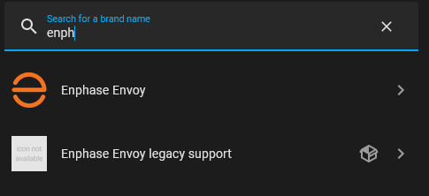
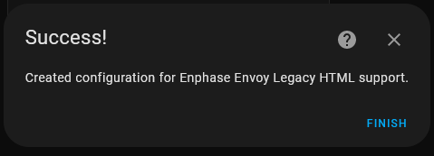
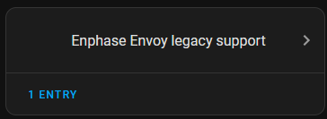
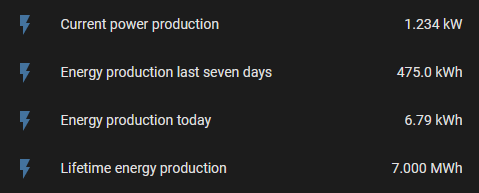

# Enphase Envoy legacy support

This is a HACS custom integration providing an Envoy Legacy HTML production data extension to the [Home Assistant Core Enphase Envoy integration](https://www.home-assistant.io/integrations/enphase_envoy) for [enphase envoys/IQ Gateways](https://enphase.com/en-us/products-and-services/envoy-and-combiner).

This custom integration is NOT a replacement for the HA Enphase Envoy integration. You still need to configure the HA Enphase Envoy integration to communicate with any Envoy type. This custom integration registers a custom updater for [pyenphase](https://github.com/pyenphase/pyenphase), which is the communication module used by HA Enphase Envoy. Once this updater is registered, Envoy production data for legacy Envoy can be collected by the HA Core Enphase Envoy integration from the HTML pages used by Envoy firmware's < 3.9

You should only deploy this custom integration when running an Enphase Envoy legacy model with firmware before 3.9, either stand-alone or in a mixed environment with newer models. The registered updater is only used for communication to the legacy Envoy, not for communication to the newer models.

Only use with Home Assistant 2023.12 or newer.

## Installation

1. Make appropriate backups of you Home Assistant installation and data.
2. Install [HACS](https://hacs.xyz/) if you haven't already
3. Add this GITHUB repository as a [custom integration repository](https://hacs.xyz/docs/faq/custom_repositories) in HACS
4. Restart Home Assistant
5. Go to the HACS Integrations page in HA, select this custom repository and download the `Enphase Envoy legacy support` custom integration
6. After download restart Home Assistant.
7. Add the custom integration using the home assistant configuration flow and select the `Enphase Envoy Legacy Support' integration

If you decide to install this manually without the use of HACS, then make sure to only place the files in custom_components/enphase_envoy_legacy_support from this repository into the folder /config/custom_components/enphase_envoy_legacy_support on your Home Assistant system.

## Usage

Once the custom integration is added, no further configuration is needed for this custom integration. All setup of the Envoy is to be done in the HA Core Enphase Envoy integration.

This custom integration or the HA Core Enphase Envoy integration can be added in any order, but as long as this custom integration is not added, HA Core Enphase Envoy can not successfully communicate with the legacy Envoy.

With a fresh Home Assistant installation that needs to communicate with a legacy Envoy best first add this custom integration to enable successful adding of the legacy Envoy next. For Home Assistant installations that went through upgrades and now show the legacy Envoy failing, installation of this custom integration will solve the issues as soon as installed.

For Home Assistant installation currently using another custom integration enabling the legacy Envoy and plan to switch to the HA Core Enphase Envoy, first install this custom integration to prepare for such a switch. As this custom integration registers with pyenphase there's no interaction with other custom integrations. How to migrate from other custom integrations to the HA Core one is not in the scope of this document.

## Add the integration

Once the custom integration is added to your system using HACS, configure it as described in [Adding Integrations](https://www.home-assistant.io/getting-started/integration/). Search for `enphase` and select `Enphase Envoy Legacy Support`

There is no further configuration information needed and the integration is created.

The newly added custom integrations shows in the integrations dashboard

In the integration details it shows as a service. The `add service` button will not add any more services. Only 1 can be added and is sufficient.
Integration detailsOptional title](docs/Added_Enphase_Legacy_Integration_Service.PNG "Integration details")

## Legacy Envoy data

A legacy Envoy only provides production data.

